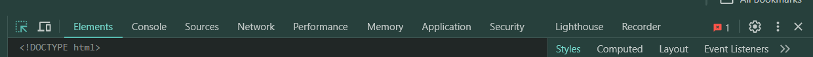
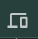

# Chrome Developer Tools

## Inspecting CSS with Chrome DevTools
- Chrome DevTools has several tabs, each with a specific purpose for web development and debugging

- **Inspect Element**  
    - allows users to select an element on the webpage and instantly view its corresponding HTML and CSS in the DevTools
- **Toggle Device Toolbar** 
    - enables "Device Mode," which simulates how a webpage appears on different screen sizes and devices, aiding in responsive design testing
- **Elements Tab:**
    - primary tab for CSS development, it contains several sub-tabs and sections specifically for inspecting and modifying styles
    - **Styles Tab**
        - displays all the CSS rules applied to the currently selected HTML element, including rules inherited from parent elements and user-agent styles (default browser styles)
        - you can inspect, enable/disable, and modify CSS properties and values directly in this tab
        - **Box Model Diagram**located within the Styles tab at the bottom
            - a interactive diagram visually represents the CSS Box Model (content, padding, border, margin)
            - allows you to directly manipulate these values to see their effect on the element's dimensions and spacing
    - **Computed Tab**
        - shows the final, resolved CSS properties applied to an element after all cascading and inheritance rules have been processed
        - useful for seeing the effective styles without being distracted by overridden declarations
    - **Layout Tab**
        - provides tools for visualizing and debugging CSS layout models like Flexbox and CSS Grid
        - allows you to inspect and modify grid and flex container properties and their items.
- While the Elements panel is central for CSS, other DevTools tabs also play a supporting role in a complete CSS workflow
    - **Sources Tab**
        - allows you to view and edit source files, including CSS files
        - you can make live edits to CSS files and see the changes reflected immediately in the browser
    - **Console Tab**primarily for JavaScript
        - can be used to log CSS-related messages or errors, or to execute JavaScript that manipulates CSS properties
_______________________________________________________

### Capture Overview
- provides a comprehensive summary of the CSS used on a web page, offering insights into various aspects of the stylesheet

### CSS Chrome Extensions
- [Pesticide](https://chromewebstore.google.com/detail/pesticide/bakpbgckdnepkmkeaiomhmfcnejndkbi)
    - a CSS debugging tool that inserts outlines onto all elements to help with debugging layout issues