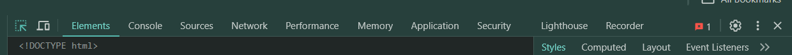
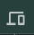

# Chrome Developer Tools

## Opening Developer Tools: Windows
- **There are sveral ways to open chrome developer tools**
    1. Press `F12` on keyboard
    2. Hold down `ctrl + Shift + I` at the same time
    3. Right click on element on page and select `inspect`
    4. Open using the `Customize and Control Google Chrome` menu in browser 
        1. Click the three dots menu in the top right corner of google chrome browser
        2. Select `More Tools` then `Developer Tools`
_______________________________________________________

## Chrome DevTools Toolbar
- Chrome DevTools has several tabs, each with a specific purpose for web development and debugging

- **Inspect Element**  
    - allows users to select an element on the webpage and instantly view its corresponding HTML and CSS in the DevTools
- **Toggle Device Toolbar** 
    - enables "Device Mode," which simulates how a webpage appears on different screen sizes and devices, aiding in responsive design testing
- **Elements Tab:**
    - allows you to inspect and modify the HTML (DOM) and CSS of a webpage
- **Console**
    - displays messages logged by JavaScript, as well as errors and warnings, and allows you to execute JavaScript code directly in the browser
- **Sources Tab**
    - enables you to view, edit, and debug JavaScript and CSS files, set breakpoints, and step through code
- **Network Tab**
    - helps analyze network requests and responses, identify performance bottlenecks, and debug issues related to loading resources. 
- **Performance Tab**
    - provides tools to record and analyze the performance of a webpage over time, including CPU usage, memory allocation, and rendering performance. 
- **Memory Tab**
    - helps diagnose and fix memory-related issues such as leaks and high memory usage. 
- **Application Tab**
    - allows you to inspect and manage various web storage technologies, such as cookies, local storage, and session storage, as well as service workers and other web app resources. 
- **Security Tab**
    - provides information about the security of the webpage, including certificate information and mixed content issues. 
- **Lighthouse Tab**
    - an automated tool for auditing the quality of web pages, checking for performance, accessibility, and other best practices. 
